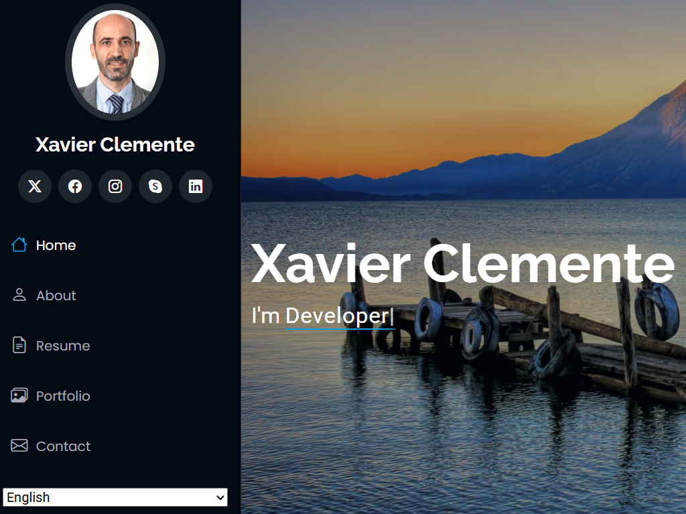

# iPortfolio - Personal Portfolio Website



**iPortfolio** is a modern, responsive personal portfolio website showcasing the professional experience, skills, and projects of Xavier Clemente, a Full Stack Developer with expertise in Java, Spring, React, Angular, and AWS. The site is built using the [iPortfolio Bootstrap template](https://bootstrapmade.com/iportfolio-bootstrap-portfolio-websites-template/) from BootstrapMade and deployed as a static site on AWS S3, with CloudFront for content delivery and Route 53 for domain management.

## Features

- **Responsive Design**: Adapts seamlessly to desktop, tablet, and mobile devices.
- **Multilingual Support**: Supports English and Spanish via i18n translations.
- **Interactive Portfolio**: Displays projects with filters (All, App, Java, Python, AWS) using Isotope.js.
- **Contact Form**: Integrated with AWS API Gateway and Lambda for form submissions (requires backend setup).
- **Skills Section**: Visual progress bars for technical skills (Java, Spring, React, AWS, etc.).
- **Animations**: Smooth transitions and effects powered by AOS (Animate On Scroll).
- **Social Media Links**: Connects to Twitter, Facebook, Instagram, Skype, and LinkedIn.

## Project Structure

```
iPortfolio/
├── assets/
│   ├── css/                  # Main CSS and vendor styles
│   ├── img/                  # Images (profile, portfolio, background, etc.)
│   ├── js/                   # Main JS and vendor scripts (i18n.js, validate.js, etc.)
│   ├── lang/                 # Translation files (en.json, es.json) for multilingual support
│   ├── vendor/               # Vendor libraries (Bootstrap, AOS, Swiper, etc.)
│   └── scss/                 # Sass source files (excluded from deployment)
├── forms/                    # Form-related files (not detailed in provided files)
├── views/                    # HTML templates
├── .gitignore                # Git ignore patterns (node_modules, .git, .vscode, etc.)
├── deploy.ps1                # PowerShell script for deploying to S3
├── index.html                # Main portfolio page
└── README.md                 # Project documentation
```

## Prerequisites

To develop or deploy the site, ensure you have:
- A modern web browser (Chrome, Firefox, Edge, etc.) for local testing.
- [AWS CLI](https://aws.amazon.com/cli/) installed and configured for deployment (`aws configure`).
- [Git](https://git-scm.com/) for version control.
- Optional: A code editor like [Visual Studio Code](https://code.visualstudio.com/) for development.

## Installation

1. **Clone the Repository**:
   ```bash
   git clone https://github.com/your-username/iportfolio.git
   cd iportfolio
   ```

2. **Serve Locally**:
   - Use a local web server to test the site (e.g., Python's HTTP server):
     ```bash
     python -m http.server 8000
     ```
   - Open `http://localhost:8000` in your browser.

3. **Modify Content** (optional):
   - Edit `index.html`, `portfolio-details.html`, etc., to update content.
   - Update `assets/img/` for custom images.
   - Modify `assets/js/i18n.js` for translations or `assets/css/main.css` for styling.

## Deployment to AWS S3

The site is deployed as a static website on an AWS S3 bucket, with CloudFront for CDN and Route 53 for domain routing. The `deploy.ps1` script automates the deployment process.

### Prerequisites
- AWS CLI installed and configured with credentials (`aws configure`).
- An S3 bucket configured for static website hosting (e.g., `s3://iportfolio-static-site-dev-92c7c0c2`).
- Permissions to write to the S3 bucket.

### Deployment Steps
1. **Navigate to the Project Directory**:
   ```powershell
   cd C:\Users\YourUsername\Desktop\xv2\portfolioXv\iPortfolio
   ```

2. **Run the Deployment Script**:
   ```powershell
   .\deploy.ps1
   ```
   - The script uses `aws s3 sync` to upload files to the S3 bucket, excluding patterns from `.gitignore` (e.g., `.git`, `node_modules`, `.vscode`) and specific files (e.g.,`.gitignore`).
   - The `--delete` flag ensures that files no longer in the local directory are removed from the bucket.

3. **Verify the Bucket**:
   ```powershell
   aws s3 ls s3://iportfolio-static-site-dev-92c7c0c2/ --recursive
   ```
   Expected files:
   - `index.html`
   - `README.md`
   - `deploy.ps1`
   - `assets/*`
   - `forms/*`
   - `views/*`

4. **Access the Site**:
   - Use node.js http server: 
     ```
     npm install -g http-server
     http-server
     ```
     Open http://localhost:8080/
   - Use the CloudFront distribution URL https://d345fgvqskm7oo.cloudfront.net/
   - If using a custom domain, configure Route 53 to point to CloudFront.

### Infrastructure
The static site is part of a broader AWS architecture, including:
- **S3**: Hosts static files (HTML, CSS, JS, images).
- **CloudFront**: Provides CDN and caching for faster delivery.
- **Route 53**: Manages the custom domain (e.g., `www.xvclemente.com`).
- **API Gateway and Lambda**: Handle dynamic form submissions (see `validate.js`).

For a detailed architecture diagram and backend setup, refer to the [infrastructure repository](https://github.com/your-username/infrastructure-repo) (placeholder, update with the actual link).

## Contact Form Setup

The contact form (`index.html`, `#contact`) submits data to an AWS API Gateway endpoint backed by a Lambda function. To enable form submissions:

1. **Update `validate.js`**:
   - Replace the placeholder `apiUrl` in `assets/js/validate.js` with your API Gateway endpoint:
     ```javascript
     const apiUrl = 'https://your-api-id.execute-api.us-east-1.amazonaws.com/contact';
     ```

2. **Deploy the Backend**:
   - Set up the Lambda function and API Gateway as described in the infrastructure repository.
   - Ensure the Lambda function processes the JSON payload from the form (name, email, subject, message).

3. **Test the Form**:
   - Submit a test form and verify the response in the browser console or Lambda logs.
   - The form displays "Your message has been sent. Thank you!" on success or an error message on failure.

## Credits

- **Template**: [iPortfolio by BootstrapMade](https://bootstrapmade.com/iportfolio-bootstrap-portfolio-websites-template/) (free version, all links and credits retained as per license).
- **Vendor Libraries**:
  - [Bootstrap](https://getbootstrap.com/)
  - [AOS](https://michalsnik.github.io/aos/)
  - [Typed.js](https://mattboldt.com/typed-js/)
  - [Isotope](https://isotope.metafizzy.co/)
  - [Swiper](https://swiperjs.com/)
  - [GLightbox](https://biati-digital.github.io/glightbox/)
- **Fonts**: Google Fonts (Roboto, Poppins, Raleway).

## License

This project uses the [BootstrapMade iPortfolio template](https://bootstrapmade.com/license/) under the free license terms. You may use and modify the template for personal or commercial purposes, provided all footer credits and links to BootstrapMade remain intact. To remove credits or use a working PHP/AJAX contact form, purchase the pro version from BootstrapMade.

Additional code and modifications by Xavier Clemente are licensed under [MIT License](LICENSE).

## Contact

For questions, collaboration opportunities, or feedback, contact Xavier Clemente:
- **Email**: [xvclemente@gmail.com](mailto:xvclemente@gmail.com)
- **Website**: [www.xvclemente.com](https://www.xvclemente.com)
- **LinkedIn**: [linkedin.com/in/xvclemente](https://linkedin.com/in/xvclemente)

---

Happy coding! 🚀